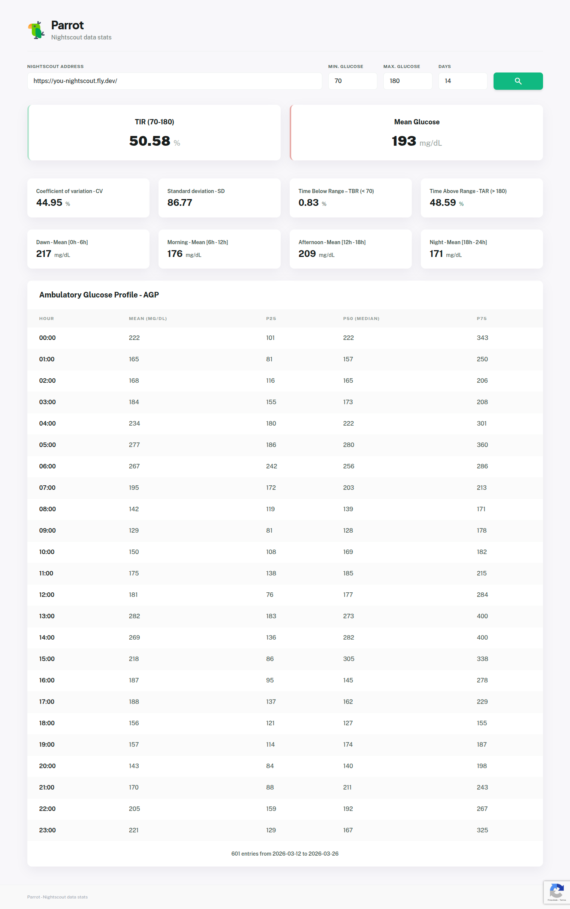

# Parrot - Nightscout data stats

Analyze your Nightscout glucose monitoring data. Track Time in Range (TIR), Mean Glucose, and Ambulatory Glucose Profile (AGP) for better diabetes management.

**Example:** https://parrot.itsgreen.com.br/

## how to run localy

    cp .env.example .env

    composer install

    php -S localhost:8989 -t public/